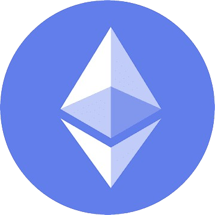

    

    <h1 align='center'>Web3 Developer-101</h1>

# Getting Started

⚠️ These resources are not just random picks from the internet; I have added the resources that I'm using to learn web3 Development.

### Prerequisite
- Basics of Web Development

### Concepts 
Before you start writing code, you must have an idea of what you are doing, what you want to develop, what problems web3 is trying to solve, and how things work. Therefore, it is necessary to have your fundamentals clear.

What is Cryptography?

- [What is Cryptography](https://chat.openai.com/share/5080537c-a8d8-4e0f-9583-3fd97aad715f)
- [Wanna Play some good Games related to Cryptography?](https://cryptohack.org/courses/intro/course_details/)
- [What is Caesar cipher?](https://en.wikipedia.org/wiki/Caesar_cipher)
- [More on Cryptography](https://cryptohack.org/courses/)

What is Blockchain and How Bitcoin Works?

- [What is Sha256? Video](https://www.youtube.com/watch?v=orIgy2MjqrA&t=204s)
- [How Bitcoin Works Video](https://www.youtube.com/watch?v=bBC-nXj3Ng4&t=1026s)
- [Blockchain Demo 101 Video](https://www.youtube.com/watch?v=_160oMzblY8&t=2s)
- [Blockchain Demo 101 Video Part 2](https://www.youtube.com/watch?v=xIDL_akeras&t=41s)
- [Blockchain Playground](https://andersbrownworth.com/blockchain/hash)

All You Need to Know about Bitcoin

- [Bitcoin WhitePaper](https://bitcoin.org/bitcoin.pdf)
- [Bitcoin WhitePaper Explain Blog](https://medium.com/coinmonks/bitcoin-white-paper-explained-part-1-4-16cba783146a)
- [Bitcoin WhitePaper Explain Video](https://www.youtube.com/watch?v=NoqNhWnjE1Q)
- [Consensus Mechanisms](https://blockworks.co/news/consensus-mechanisms-guide)
- [Proof of Work](https://blockworks.co/news/what-is-proof-of-work)
- [How Does Proof of Work Work?](https://learnweb3.io/degrees/ethereum-developer-degree/sophomore/how-does-proof-of-work-work)

What the heck is Ethereum?

- [What is Ethereum](https://aws.amazon.com/blockchain/what-is-ethereum/)
- [Ethereum WhitePaper](https://ethereum.org/669c9e2e2027310b6b3cdce6e1c52962/Ethereum_Whitepaper_-_Buterin_2014.pdf)
- [How Does Proof of Stake Work?](https://learnweb3.io/degrees/ethereum-developer-degree/sophomore/how-does-proof-of-stake-work)
- [What is Gas in Ethereum (Transaction fee)?](https://ethereum.org/en/developers/docs/gas/)
- [What EVM(Ethereum Virtual Machine)?](https://ethereum.org/en/developers/docs/evm/)

What is NFT?

What is Oracles?

What is ChainLink?

What is Avalanche Network?

What is Solana?

[What is a crypto wallet? Is it similar to a password manager?](https://www.coinbase.com/en-gb/learn/crypto-basics/what-is-a-crypto-wallet)

# Learning Solidity
Solidity is a statically-typed programming language designed for developing smart contracts that run on Ethereum.

[Crypto Zombies](https://cryptozombies.io/en/solidity) is a great website for learning Solidity with hands-on experience. [Solving Video](https://www.youtube.com/watch?v=ERAxd8gl1Eg&t=7079s). I suggest you do it by yourself and watch this video too(2-3 min of each chapter, then you start doing it by yourself) because in this video, he is comparing game concepts with real-world scenarios.

You can find the Solidity Code for Crypto Zombies Chapaters in this repo.

## Solidity Security
[Solidity Security-CTF](https://ethernaut.openzeppelin.com/) - Learn Solidity Security by playing CTF's.

